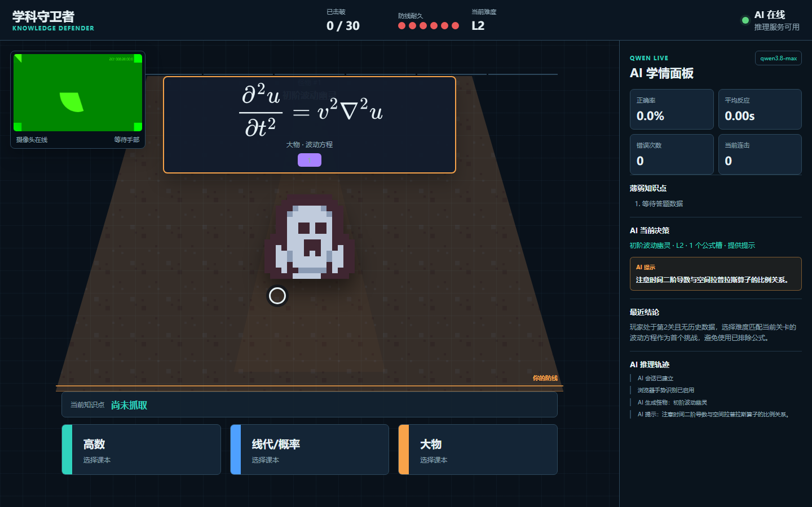

# Knowledge Defender / 学科守卫者

一个用摄像头手势操作的第一人称学科知识巩固游戏。高数、线代/概率论和大物公式会生成怪物，玩家抓取课本中的知识点并投掷给怪物。Qwen 负责判题、解释、动态难度和学习报告，题库只提供可靠的知识边界与公式来源。



## 为什么它是 AI 产品

AI 不是界面上的装饰聊天框，而是主要玩法能否成立的核心。去掉 Qwen 后，游戏无法可靠地判断知识点与公式的语义关系，也无法根据实时学情生成下一只怪物和个性化报告，因此主要产品价值不成立。

| 游戏环节 | AI 承担的工作 | 玩家能看到什么 |
| --- | --- | --- |
| 怪物生成 | 根据正确率、反应速度、连击和错误记录选择难度与公式组合 | `AI 决策：...难度 L2，2 个公式槽` |
| 知识点投掷 | 理解公式和玩家所选知识点的语义关系 | `AI 分析中...`，随后显示 `关联度 95%` |
| 错误分析 | 找出真正知识点，说明为什么错、下一步怎么做 | `AI 解释` 与 `AI 反馈` |
| 难度调整 | 连续正确时提高挑战，连续错误时降低挑战 | 下一只怪物的等级、公式数量和提示状态 |
| 学习报告 | 汇总知识点掌握度、强弱项、章节和行动建议 | 结算页逐条显示 AI 报告 |

AI 采用“约束式生成”而不是任意编题：

1. `data/formulas.json` 维护经过整理的公式、所属学科和知识点关系。
2. Qwen 根据实时学情从公式库中选择并组合怪物公式。
3. Qwen 独立判断玩家所选知识点是否能解决公式，关联度达到 80% 才判定成功。
4. 模型输出经过字段、类型和公式 ID 校验，非法结果不会进入游戏状态。
5. AI 服务失败时游戏明确暂停并显示原因，不使用随机数或固定模板伪装成功。
6. `qwen3.8-flash` 负责低延迟怪物决策和判题，服务器会在玩家阅读候选项时提前完成匹配。
7. 服务器记录最近使用过的公式，避免不同会话第一题反复出现同一道基础题。

摄像头画面只在本机由 MediaPipe 处理。调用 Qwen 时只发送公式、候选概念文字和匿名统计指标，不发送视频帧。

公式使用 MathJax 排版，积分上下限、分式、根号和偏导等符号不依赖普通字体硬拼。怪物精灵和地牢地面来自 Kenney Tiny Dungeon（CC0），许可证保存在 `web/assets/kenney/License.txt`。

大学物理题库包含拉格朗日方程、角动量、转动惯量、伯努利方程、纳维-斯托克斯方程、热力学第一定律、熵、卡诺循环、玻尔兹曼熵、配分函数、麦克斯韦关系和傅里叶热传导等内容，不再只停留在 `F=ma` 一级。

## 目标用户与场景

- 大学低年级学生复习高数、线性代数、概率论和大学物理。
- 课堂教学中作为限时巩固活动。
- AI 产品展示中用于证明“输入理解、工具约束、模型决策、可解释输出”的完整闭环。
- GitHub 作品集中展示计算机视觉、游戏循环和大模型结构化调用能力。

## 核心玩法

1. 默认需要击破 30 只怪物才能获胜，玩家防线耐久为 6。
2. 每只怪物由一个或多个公式组成，难度越高，公式槽越多。
3. 屏幕下方有三本书：高数、线代/概率和大物。
4. 用手掌移动光标，握拳展开课本并抓取知识点。
5. 把知识点移向怪物后张开手掌投掷。
6. AI 输出语义关联度、解释和反馈。关联度至少 80% 且模型判定有效时，当前公式被清除。
7. 答错时怪物向前移动一格并扣减 1 点防线耐久，同时显示错误解释。
8. 怪物到达玩家面前或防线耐久归零时失败。
9. 每局结束由 AI 生成学习报告，并保存到 `reports/session_*.json`。

正式视频演示建议使用以下参数把一局缩短到便于录制的时间，默认游戏规则不受影响：

```powershell
python main.py --target-enemies 3
```

## 浏览器版：链接直接玩

`web_server.py` 提供评委使用的浏览器版。摄像头、手势识别和游戏界面都在浏览器运行，Qwen Key 只保存在服务器端。

本地启动：

```powershell
.venv\Scripts\Activate.ps1
python web_server.py --host 127.0.0.1 --port 8000 --access-token "your-demo-token" --target-enemies 30
```

本机访问：

```text
http://127.0.0.1:8000/?token=your-demo-token
```

如果服务器运行在你自己的电脑上，要让评委从其他电脑访问，可以使用 Cloudflare Quick Tunnel：

```powershell
cloudflared tunnel --url http://127.0.0.1:8000
```

命令会输出一个 `https://...trycloudflare.com` 地址。把访问令牌拼到链接后面：

```text
https://实际分配的地址/?token=your-demo-token
```

仓库也提供了自动化启动脚本。安装 Cloudflare Tunnel 后运行：

```powershell
.\tools\start_public_web.ps1
```

脚本会生成随机访问令牌、启动 Web 服务、建立公网隧道，并把最终链接输出到终端和 `runtime/public-link.txt`。

这种模式有以下边界：

- 运行服务器的电脑必须保持开机和联网。
- Cloudflare Quick Tunnel 地址重新启动后可能变化。
- 评委浏览器需要允许摄像头权限。
- 你的 Qwen Key 不会出现在链接、网页源码或 GitHub 中。
- 服务端默认对 AI 接口做每 IP 限流，访问令牌用于避免链接被随机滥用。
- MediaPipe 浏览器运行库和手部模型已放在仓库内，不依赖 Google Storage。
- 页面第一次进入会请求摄像头权限。摄像头不可用时仍能用鼠标完成游戏，但正式演示应使用手势。

如果要长期在线，可以把同一个 `web_server.py` 部署到支持 Python 服务的云主机或 Render，并设置：

```text
DASHSCOPE_API_KEY
WEB_ACCESS_TOKEN
WEB_TARGET_ENEMIES=30
```

启动命令：

```powershell
python web_server.py --host 0.0.0.0 --port $PORT
```

## 手势与备用操作

手势是正式演示方式：

| 手势 | 游戏动作 |
| --- | --- |
| 移动手掌 | 移动光标 |
| 握拳 | 打开课本、抓取知识点或取消当前抓取 |
| 张开手掌 | 光标位于怪物区域时投掷 |

没有摄像头时可以使用鼠标或键盘，但 AI 仍是真实 Qwen 调用：

```powershell
# 鼠标：左键抓取或选择，右键取消
python main.py --no-camera --input mouse

# 键盘：WASD 移动，F 抓取，空格投掷，Esc 退出
python main.py --no-camera --input keyboard
```

## 安装

推荐 Python 3.12。MediaPipe 对 Python 3.13 的支持取决于其发布的 wheel，使用 3.12 可以减少兼容问题。

### 使用 uv

```powershell
uv venv --python 3.12 .venv
uv pip install --python .venv\Scripts\python.exe -r requirements.txt
.venv\Scripts\Activate.ps1
```

### 使用标准 venv

```powershell
py -3.12 -m venv .venv
.venv\Scripts\Activate.ps1
python -m pip install -r requirements.txt
```

## 配置 Qwen

复制示例文件并填写真实 Key：

```powershell
Copy-Item .env.example .env
```

```dotenv
DASHSCOPE_API_KEY=你的_API_Key
QWEN_MODEL=qwen3.8-max
QWEN_BASE_URL=https://dashscope.aliyuncs.com/compatible-mode/v1
QWEN_TIMEOUT_SECONDS=45
```

程序也会读取 `C:\Users\你的用户名\.codex\.env`。项目根目录的 `.env` 与用户级 `.env` 都已加入忽略规则，不要把真实 Key 提交到 GitHub。

## 运行

```powershell
.venv\Scripts\Activate.ps1
python main.py
```

常用参数：

```powershell
python main.py --camera 0
python main.py --fullscreen
python main.py --target-enemies 3
python main.py --no-camera --input mouse
python main.py --smoke-test
```

## 测试与验证

```powershell
python -m pytest -q
python -m py_compile main.py web_server.py game_engine.py ai_matcher.py ai_tracker.py hand_tracker.py
$env:SDL_VIDEODRIVER="dummy"
python main.py --smoke-test --no-camera --input mouse
```

测试覆盖公式知识关系、正确/错误判定、6 次错误失败、30 只怪物获胜、复合公式怪物、AI JSON 解析和浏览器会话接口。`--smoke-test` 不调用模型也不打开摄像头，只验证界面和基础数据可初始化。

## AI 调用链路

```text
摄像头帧
  -> 浏览器或桌面端 MediaPipe 识别手部关键点与手势
  -> 游戏界面将手势映射为光标、抓取和投掷
  -> 当前公式 + 玩家选择 + 候选人知识点
  -> 服务端调用 Qwen 语义判题与错误解释
  -> 关联度、判定和反馈显示在屏幕上
  -> 更新正确率、反应时间和知识点统计
  -> Qwen 读取最新学情，设计下一只怪物
  -> 游戏结束，Qwen 生成个性化学习报告
```

网络请求运行在后台工作线程中，因此显示 `AI 分析中` 时摄像头预览和游戏画面仍可刷新。

## 项目结构

```text
knowledge-defender/
├── main.py                 # Pygame 界面、状态机、游戏循环
├── web_server.py           # 浏览器版服务器、会话和 AI 代理
├── web/
│   ├── index.html          # 浏览器游戏界面
│   ├── styles.css          # 响应式界面样式
│   ├── app.js              # 浏览器摄像头、手势和游戏状态
│   ├── assets/kenney/      # CC0 怪物、地面和许可证
│   ├── models/             # 本地手部识别模型
│   └── vendor/             # MediaPipe Tasks Vision、WASM 与 MathJax
├── hand_tracker.py         # MediaPipe Hands 与手势识别
├── game_engine.py          # 怪物、公式、答题、胜负和学情统计
├── ai_matcher.py           # Qwen API、结构化输出、后台工作线程
├── ai_tracker.py           # 构造最小化的 AI 决策与判题请求
├── tools/
│   └── capture_preview.py  # 使用真实 Qwen 决策生成 README 预览图
├── data/
│   ├── formulas.json       # 公式、学科、知识点关系
│   └── knowledge.json      # 知识点、章节和说明
├── tests/
│   ├── test_game_engine.py
│   ├── test_ai_matcher.py
│   └── test_web_server.py
├── docs/
│   └── preview.png
├── assets/                 # 当前使用 Pygame 几何图形，无外部素材依赖
├── requirements.txt
├── requirements-dev.txt
└── README.md
```

## 演示视频拍摄建议

视频建议 60 至 90 秒。默认 30 只怪物更适合真实挑战；拍摄完整演示时可使用 `--target-enemies 3` 快速进入学习报告。

画面布局：

- 左上角显示摄像头画面、手部关键点和识别动作。
- 中央显示第一人称怪物、公式槽位和内容选择界面。
- 右侧显示 AI 学情面板、当前决策和推理轨迹。

推荐分镜：

1. 0 至 8 秒：展示摄像头手部关键点，手掌移动控制光标。
2. 8 至 18 秒：握拳展开课本，抓取一个知识点，张开手投掷。
3. 18 至 30 秒：拍清 `AI 分析中`、关联度、AI 判定、解释和反馈。
4. 30 至 42 秒：展示怪物消灭或前进，以及下一只怪物难度决策。
5. 42 至 55 秒：连续完成几次操作，展示右侧正确率、反应时间和薄弱点实时变化。
6. 55 至 75 秒：结束游戏并展示 AI 学习报告。
7. 结尾 5 秒：展示 GitHub 仓库地址和技术栈。全程不用露脸或说话，信息由屏幕文字表达。

录制完成后，把快手视频链接替换到下面：

```text
演示视频：待录制后填写
```

## GitHub

当前仓库：

```text
https://github.com/fahlim520/game
```

首次提交：

```powershell
git add .
git commit -m "Build AI-powered hand gesture learning game"
git push origin main
```

## 常见问题

**提示缺少 `DASHSCOPE_API_KEY`**

检查项目根目录 `.env` 或用户级 `.codex/.env`。程序不会用随机判定替代真实 AI，因此未配置时会暂停。

**摄像头无法打开**

关闭占用摄像头的会议软件，检查 Windows 隐私设置，或先用 `--no-camera --input mouse` 验证界面和 API。

**MediaPipe 安装失败**

确认使用 Python 3.12 和 64 位解释器，然后重新创建虚拟环境并安装依赖。

**模型名称不可用**

在 `.env` 中修改 `QWEN_MODEL`。默认配置为 `qwen3.8-max`，也可以在阿里云百炼控制台选择当前账号可用模型。

**AI 返回格式异常**

客户端会严格校验输出并暂停，不会把无效结果写入成绩。按 `R` 重试；若持续发生，检查网络、模型和 API 配额。
